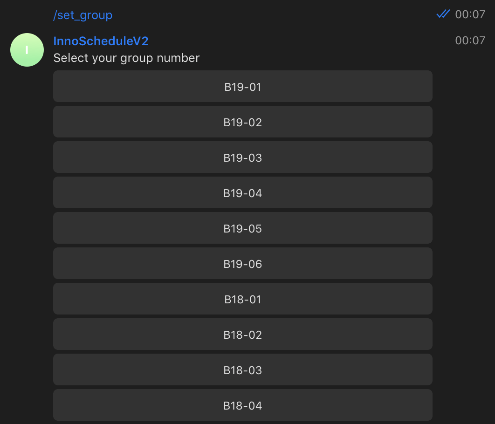
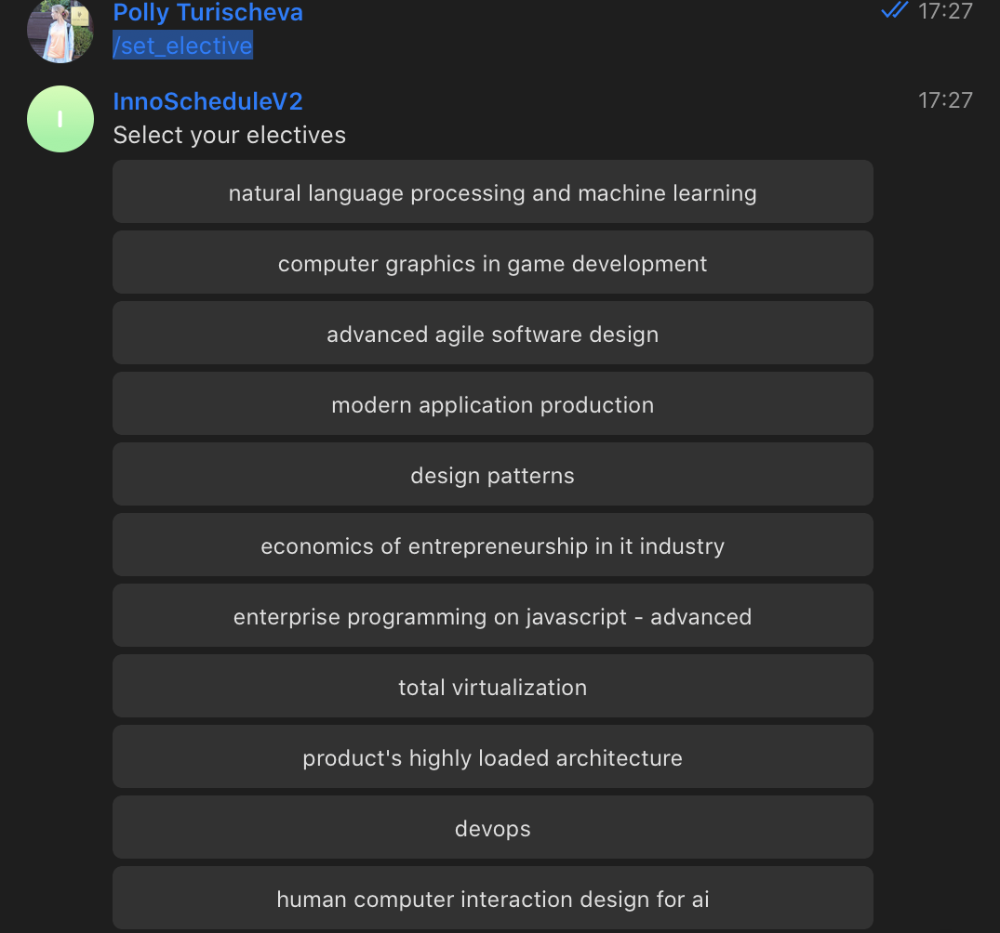

# Scala Telegram Schedule Bot
### Description
 This is a bot helps to organize students life remaining about upcoming classes. It is implemented based on Innopolis University Schedule for Spring 2020, however, you can change Parsing module and adapt it for your timetable. It supports obligatory regular classes and non-regular elective classes.
 ###  Commands
 * `/set_group` - returns markup with possible groups, the markup disappear after the group was chosen and setup  
 
 * `/set_elective` - returns markup with electives, markup disappear after elective was chosen and setup
 
 * `/change_group` - same user experience as /set_group. It changes info about user in database, remove old remainders and setups new ones.
 * `/core_link` - returns link to corresponding google-doc table
 * `/electives_link` - returns link to corresponding google-doc table
 * `/my_courses` - returns the list of your courses, including electives or the message that you do not have any courses yet
 ```
Your courses 
 control theory
data modeling and databases 2
functional programming and scala language
introduction to ai
networks
probability and statistics
software project
```
 * `/today` - returns all your classes for today in format
 ```Your courses for today are 
     Lectures 
     (mathematical analysis 2,sergey gorodetskiy,09:00-10:30,108) 
     Tutorials  
     (mathematical analysis 2,Some(sergey gorodetskiy),Some(10:35-12:05),Some(108))
     Labs    
     (mathematical analysis 2,alexey shikulin,12:10-13:40,101)
```
 * `/day +weekday` (example: `/day tuesday`) - same as /today but for a specified day
 * `/set_subject_group + group + subject` (example: `/set_subject_group B17-DS-01 Digital Signal Processing`) - this is intended to use when you have this 
 * `/groups_for + subject` (example: `/groups_for control theory`) - list of groups, which have this subject. If subject does not have labs or does not exist at all, it will return a message that group are not important for this subject.
 * `/set_core + group + subject` - will add your this core course with a specified group.
 * `/turn_off_notification + subject` - will turn off notifications for the selected subject. One command will work for both core courses and electives.
 * `/delete_subject +subject` - will destroy notifications for the selected subject if there were any and delete it from your courses. One command will work for both core courses and electives.
 * `/groups` - returns list of all possible groups
 ```
List of all possible groups : 
 B19-01
B19-02
B19-03
B19-04
B19-05
B19-06
B18-01
...
```
*All commands, which add subjects automatically sets up notifications 10 min before a class, for electives there are 2 notifications, 1 day before and 10 minutes before. All commands deleting/changing a subject automatically disable unnecessary notifications.*
### Run
To run the project, just run main, to stop the bot, just push a space button.
 